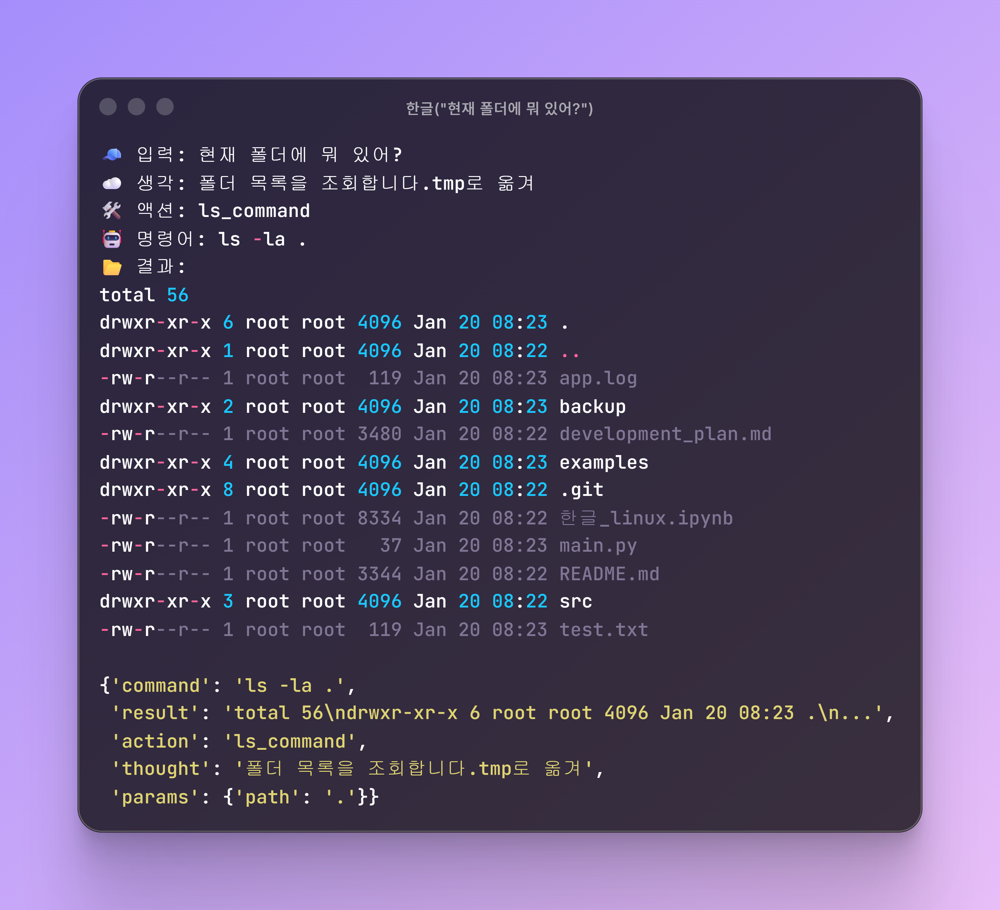
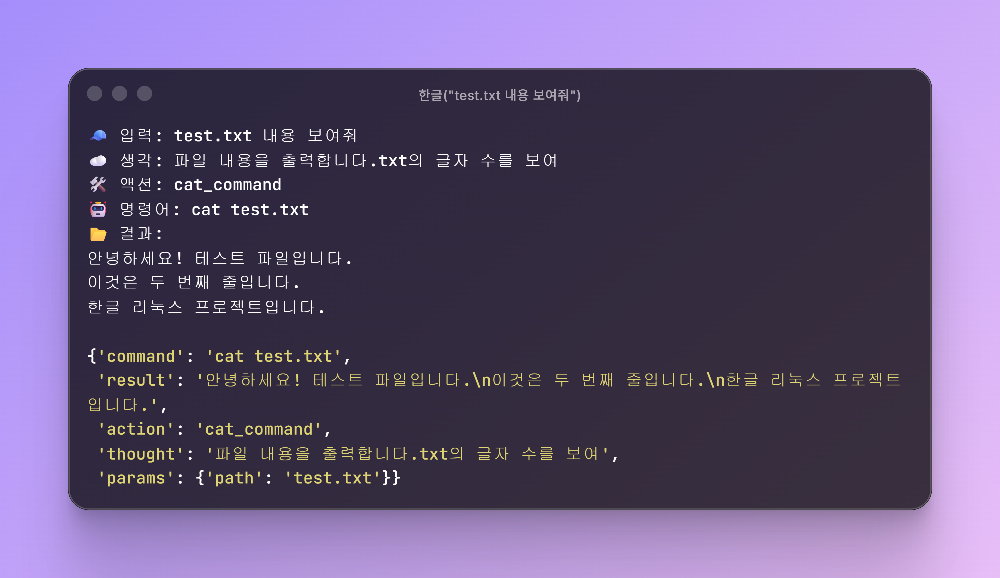
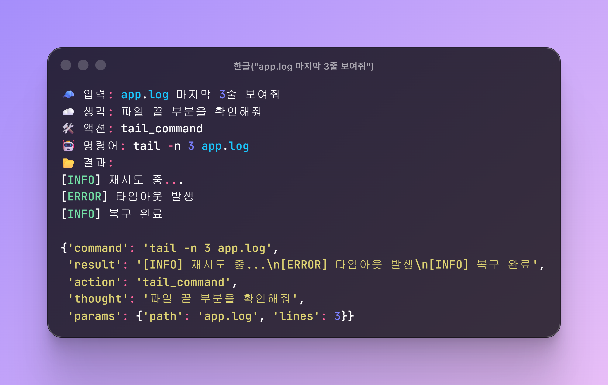
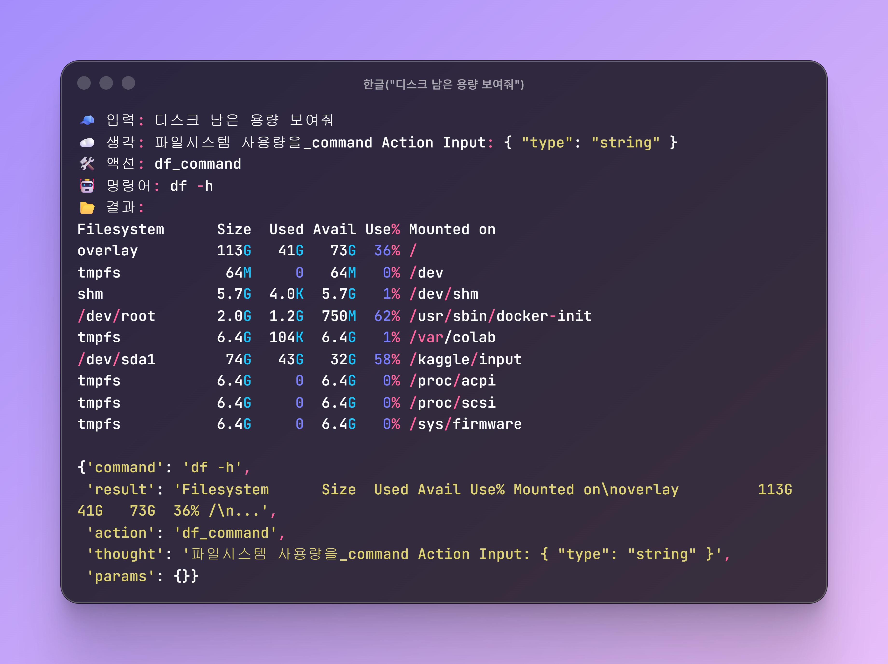

# 🐧 Korean Linux Colab

> **한국어로 리눅스 명령어를 실행하세요!**  
> 명령어를 몰라도 OK - AI가 Google Colab에서 한국어를 리눅스 명령어로 바꿔줍니다

[](https://colab.research.google.com/github/gyunggyung/korean-linux-colab/blob/main/한글_linux.ipynb)

---

## ✨ 특징

- 🇰🇷 **한국어 자연어 입력** → 리눅스 명령어 자동 변환
- 🚀 **설치 불필요** - Colab에서 바로 실행
- 🛡️ **안전한 학습 환경** - Colab 가상 환경에서 실행
- 🤖 **AI 기반** - HybriKo-117M 모델 사용

---

##  Quick Start

### Colab에서 바로 실행
[](https://colab.research.google.com/github/gyunggyung/korean-linux-colab/blob/main/한글_linux.ipynb)

### 사용 예시
```python
한글("현재 폴더에 뭐 있어?")      # ls -la
한글("test.txt 내용 보여줘")      # cat test.txt
한글("main.py 몇 줄이야?")        # wc -l main.py
한글("구글에 핑 날려봐")          # ping -c 4 google.com
```

---

## 📸 실행 예시

### 📁 "현재 폴더에 뭐 있어?"


### 📄 "test.txt 내용 보여줘"


### 📋 "app.log 마지막 3줄 보여줘"


### 💾 "디스크 남은 용량 보여줘"


---

## ✅ 잘 되는 명령어 (92% 성공률)

| 작업 | 한국어 명령 | 결과 |
|------|------------|------|
| 파일 목록 | `현재 폴더에 뭐 있어?` | ✅ `ls -la .` |
| 파일 내용 | `test.txt 내용 보여줘` | ✅ `cat test.txt` |
| 줄 수 | `main.py 몇 줄이야?` | ✅ `wc -l main.py` |
| 파일 끝부분 | `app.log 마지막 3줄 보여줘` | ✅ `tail -n 3 app.log` |
| 텍스트 검색 | `app.log에서 'ERROR' 찾아줘` | ✅ `grep 'ERROR' app.log` |
| 디스크 용량 | `디스크 남은 용량 보여줘` | ✅ `df -h` |
| 폴더 용량 | `현재 폴더 용량 얼마야?` | ✅ `du -sh .` |
| 프로세스 | `실행 중인 프로세스 보여줘` | ✅ `ps aux` |
| 네트워크 | `구글에 핑 날려봐` | ✅ `ping -c 4 google.com` |
| 폴더 만들기 | `newdir 폴더 만들어줘` | ✅ `mkdir -p newdir` |
| 파일 복사 | `test.txt를 backup/으로 복사해` | ✅ `cp -r test.txt backup/` |
| 폴더 이동 | `examples 폴더로 이동해` | ✅ `cd examples` |

---

## ⚠️ 아직 불안정한 명령어

> **Note**: 117M 소형 모델의 한계로 일부 명령어는 아직 불안정합니다.

| 작업 | 한국어 명령 | 현재 상태 |
|------|------------|----------|
| 파일 찾기 | `현재 폴더에서 txt 파일 찾아줘` | ⚠️ `find` 대신 `grep` 사용 |

> **알려진 이슈**: 모델의 `thought` 필드에 훈련 데이터의 다음 예제가 일부 섞여 나오는 현상이 있습니다 (기능에는 영향 없음).

**개선 예정**: 더 큰 모델로 SFT를 진행하면 정확도가 향상될 예정입니다.

---

## 📋 지원 명령어 (21개)

| 파일 관리 | 시스템 | 네트워크 |
|-----------|--------|----------|
| `ls`, `cd`, `mkdir` | `ps`, `df`, `du` | `ping`, `curl` |
| `rm`, `cp`, `mv` | `top`, `wc` | |
| `find`, `cat`, `grep` | `chmod`, `tar` | |
| `head`, `tail` | | |

---

## 🔧 기술 스택

- **모델**: [HybriKo-117M-LinuxFC-SFT-v2](https://huggingface.co/Yaongi/HybriKo-117M-LinuxFC-SFT-v2)
- **아키텍처**: Griffin-style Hybrid (RNN + Attention)
- **파라미터**: 117.8M
- **Action Name 정확도**: 92% (12개 테스트 중 11개 성공)
- **Parameters 정확도**: 약 90% (대부분 정상 작동)

---

## 📄 License

Apache License 2.0

---

## 🙏 Acknowledgments

- HybriKo 모델 개발: [@gyunggyung](https://github.com/gyunggyung) [@victor0777](https://github.com/victor0777)
